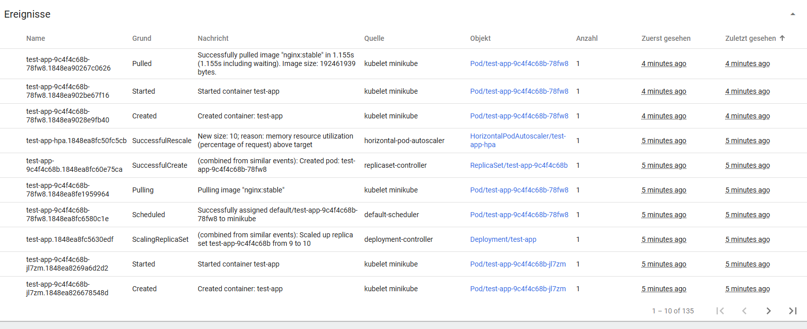

# Динамическое масштабирование контейнеров в Kubernetes (Task2)

## Цель задания

Реализовать автоматическое масштабирование приложения в Kubernetes на основе использования оперативной памяти с помощью Horizontal Pod Autoscaler (HPA).

---

## Выполненные шаги

### 1️⃣ Запуск Minikube и настройка кластера

- Создан локальный кластер Kubernetes с помощью Minikube:
```bash
minikube start --memory=4096 --cpus=2
```

- Активирован `metrics-server` для сбора метрик:
```bash
minikube addons enable metrics-server
```

---

### 2️⃣ Развёртывание тестового приложения

- Написан и применён `deployment.yaml` для приложения с лимитами памяти:
```yaml
resources:
  requests:
    memory: "10Mi"
  limits:
    memory: "15Mi"
```

- Использован образ:
```dockerfile
nginx:stable
```

- Применение:
```bash
kubectl apply -f deployment.yaml
```

### 3️⃣ Создание сервиса для доступа к приложению

- Написан и применён `service.yaml` с типом NodePort для доступа из браузера:
```bash
kubectl apply -f service.yaml
```

- Получен URL:
```bash
minikube service test-app-service --url
```

### 4️⃣ Настройка Horizontal Pod Autoscaler (HPA)

- Написан и применён `hpa.yaml`:
```yaml
apiVersion: autoscaling/v2
kind: HorizontalPodAutoscaler
spec:
  minReplicas: 1
  maxReplicas: 10
  metrics:
  - type: Resource
    resource:
      name: memory
      target:
        type: Utilization
        averageUtilization: 30
```

- Применение:
```bash
kubectl apply -f hpa.yaml
```

### 5️⃣ Генерация нагрузки

- Написан `locustfile.py`:
```python
from locust import HttpUser, task

class WebsiteUser(HttpUser):
    @task
    def index(self):
        self.client.get("/")
```

- Запуск Locust:
```bash
py -m locust
```

- Настроена нагрузка:
  - Number of users: 500-1000
  - Spawn rate: 50-100

### 6️⃣ Результаты масштабирования

- HPA увеличил количество реплик с 1 до 9 в ответ на нагрузку.
- Собраны скриншоты дашборда и логи:
```bash
kubectl get hpa > hpa-final.txt
kubectl get pods > pods-final.txt
kubectl describe hpa test-app-hpa > hpa-describe.txt
```





---

## Итог

Автоматическое масштабирование приложения на основе использования памяти настроено и проверено в действии с помощью Locust.