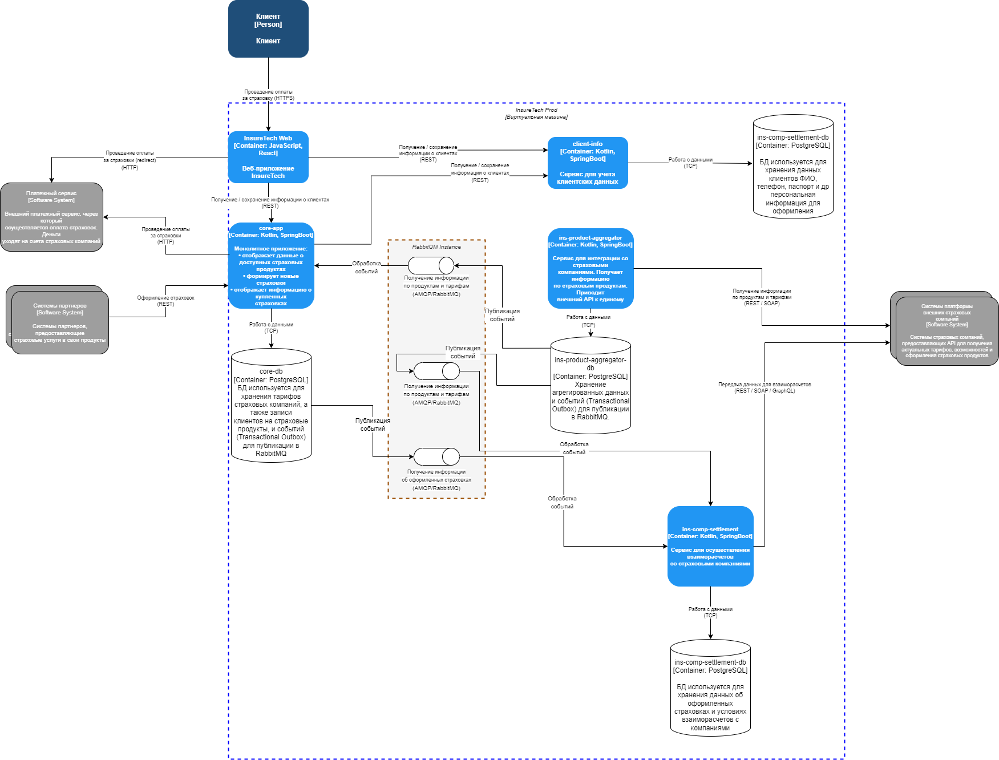

# Анализ текущей архитектуры и рисков при росте нагрузки

## Проблемы текущей архитектуры

- **Слабая отказоустойчивость**  
Сервисы сильно зависят от синхронного взаимодействия с `ins-product-aggregator`. Если этот сервис недоступен или отвечает с большой задержкой (например, из-за проблем с API страховых компаний), зависнут и `core-app`, и `ins-comp-settlement`. Это повышает риск недоступности системы в целом.

 - **Жёсткая связка компонентов**  
Сервисы тесно связаны через REST API, что приводит к тому, что сбой или перегрузка одного сервиса влияет на другие. Нет изоляции с точки зрения нагрузки и отказов.

- **Проблемы масштабируемости**  
С ростом числа страховых компаний и увеличением числа запросов нагрузка на `ins-product-aggregator` растёт пропорционально росту числа запросов в `core-app` и `ins-comp-settlement`. Это вынуждает масштабировать все связанные компоненты одновременно, а не только нуждающийся в масштабировании сервис. По сути, архитектура мало отличается от монолита в плане гибкости масштабирования.

-  **Риск потери данных и нарушения консистентности**  
Сейчас данные о продуктах и тарифах хранятся в локальных репликах. Если запросы за обновлением этих данных (каждые 15 минут / раз в сутки) не проходят из-за сбоя, данные остаются устаревшими, что может привести к оформлению некорректных страховок или ошибкам во взаиморасчётах.

- **Увеличение времени отклика (latency)**  
Время отклика на стороне клиента увеличивается за счёт цепочки синхронных вызовов и необходимости дождаться ответа от всех страховых компаний в одном запросе. Это критично при росте числа интеграций (добавление новых 5 страховых компаний).

- **Риски при росте числа партнёров и компаний**  
С добавлением новых страховых компаний увеличится количество внешних вызовов и вероятность ошибок от этих интеграций. Это дополнительно повысит нагрузку и усугубит проблемы задержек и сбоев.

---

## Основные риски при планируемом росте нагрузки

- **Рост числа внешних интеграций** → экспоненциальное увеличение числа REST-запросов, больше вероятность таймаутов и ошибок.
- **Ограничения масштабирования** → необходимость масштабировать весь стек вместо отдельных сервисов.
- **Невозможность быстро реагировать на сбои** → отсутствие событийной модели затрудняет мониторинг и реагирование на изменения в состоянии данных.
- **Блокировки развития бизнеса** → архитектура становится «бутылочным горлышком» для подключения новых партнёров и проведения рекламных кампаний с резким ростом пользователей.

---

## Преимущества перехода на Event-Driven архитектуру

Переход на событийно-ориентированную архитектуру позволит:
- Развязать сервисы и уменьшить зависимости.
- Обеспечить асинхронную обработку событий (например, обновление тарифов и продуктов по мере их поступления).
- Реализовать механизмы ретраев и гарантий доставки сообщений (например, через Kafka, RabbitMQ).
- Хранить данные о продуктах в локальных репозиториях, обновляемых по событию, а не по таймеру.
- Масштабировать каждый компонент независимо от других.

---

# Обоснование архитектурного решения для Task3

## Цели изменений

В рамках выполнения Task3 переработана архитектура взаимодействия между сервисами InsureTech для устранения выявленных рисков:
- устранение жёсткой связки компонентов (тесной зависимости между сервисами);
- повышение отказоустойчивости;
- улучшение масштабируемости;
- сокращение времени отклика системы при росте числа интеграций со страховыми компаниями.

Основная идея решения — переход от синхронного взаимодействия по REST к событийно-ориентированной архитектуре (Event-Driven Architecture) с использованием брокера сообщений.

---

## Логика выбора архитектуры

При анализе текущих проблем выявлены следующие ключевые недостатки:
- Сервисы были тесно связаны через синхронные REST-вызовы, что приводило к цепным задержкам и сбоям при отказах отдельных компонентов.
- Увеличение числа интеграций с новыми страховыми компаниями прямо увеличивало нагрузку на систему и требовало масштабирования сразу нескольких сервисов.
- В случае сбоя в одном из внешних API данные могли устаревать или становиться недоступными, что создавало риски для бизнес-процессов.

Для устранения этих проблем принято решение реализовать асинхронный обмен сообщениями. В качестве инструмента рассматривались два варианта:
- **RabbitMQ**
- **Apache Kafka**

---

## Выбор брокера сообщений

Результаты сравнения инструментов:

| Критерий | RabbitMQ | Kafka |
|-----------|----------|-------|
| Простота развёртывания и эксплуатации | ✅ проще | ❌ требует более сложной инфраструктуры |
| Гарантии доставки сообщений | ✅ есть (ack, durable queue) | ✅ есть (сильнее по части хранения истории) |
| Масштабируемость | ✅ подходит для десятков-сотен сообщений в секунду | ✅ подходит для тысяч сообщений в секунду |
| Поддержка Transactional Outbox | ✅ легко реализуется | ✅ реализуется, но требует больше настроек |
| Подходит для потоковой аналитики | ❌ нет | ✅ да |

RabbitMQ выбран как оптимальный вариант, так как:
- объёмы событий в InsureTech предполагаются умеренные (десятки — сотни сообщений в секунду);
- задача заключается в обеспечении надёжной доставки событий и развязке сервисов без необходимости хранения истории всех событий;
- RabbitMQ проще в эксплуатации и быстрее внедряется в инфраструктуру;
- подходит для решения поставленных задач с минимальными накладными расходами.

---

## Архитектура решения

В обновлённой архитектуре:
- **ins-product-aggregator** публикует события в брокер сообщений после успешного получения и сохранения данных (через Transactional Outbox).
- **RabbitMQ** используется как центральный элемент маршрутизации событий.  
   Используется один экземпляр RabbitMQ (один брокер), внутри которого настроены exchange и отдельные очереди для каждого потребителя (`core-app`, `ins-comp-settlement`).
- **core-app** и **ins-comp-settlement** получают события из своих очередей и обновляют локальные реплики данных.
- Взаимодействие между сервисами переведено на асинхронную модель, что повысило гибкость и отказоустойчивость системы.

---

## Итог

Применение RabbitMQ с паттерном Transactional Outbox позволило:
- развязать сервисы и исключить жёсткие зависимости;
- снизить влияние внешних API на стабильность работы системы;
- реализовать гибкое масштабирование компонентов;
- обеспечить надёжную доставку событий с гарантией сохранности данных.

Диаграмма контейнеров отражает новую архитектуру с указанием RabbitMQ как отдельного контейнера и демонстрирует движение событий от публикации до обработки подписчиками.

