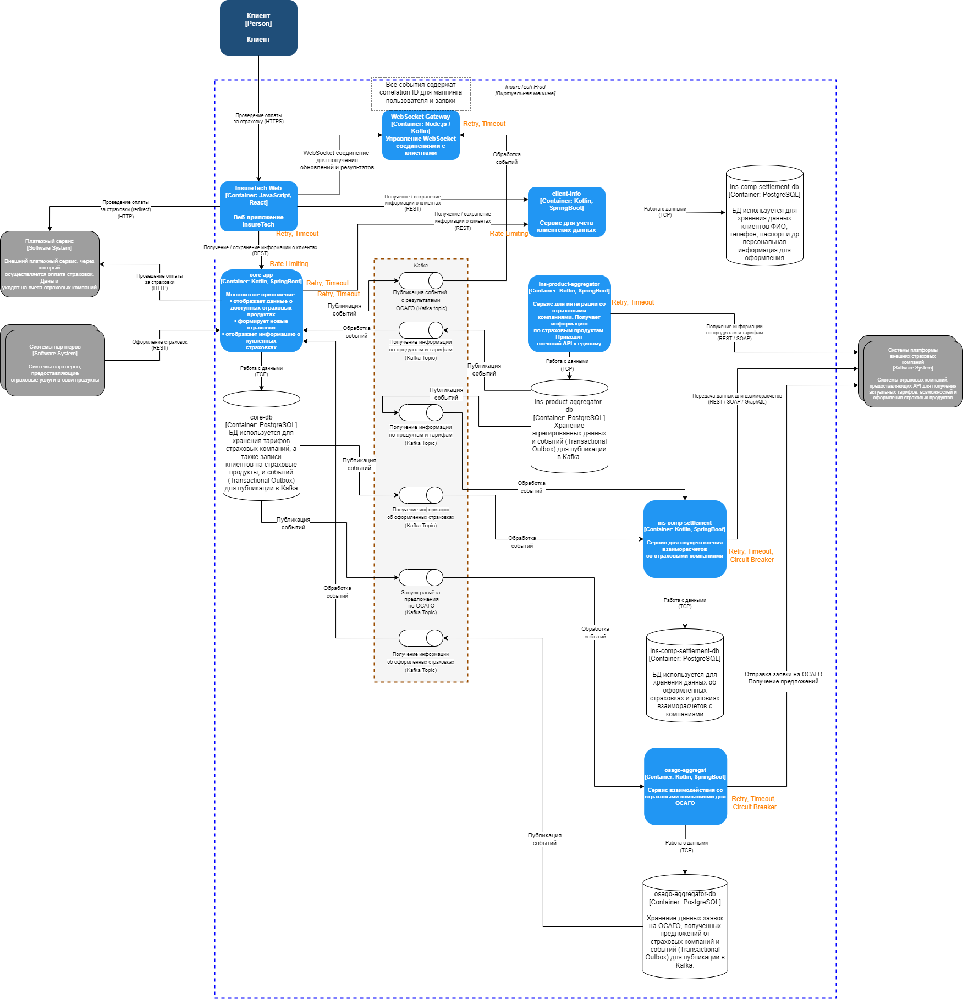

# Решение архитектуры для оформления ОСАГО

## Использование Kafka

Для интеграции между `core-app` и `osago-aggregator`, а также для отправки событий от `core-app` в `WebSocket Gateway` выбран **Kafka**.

**Причины выбора Kafka:**
- Поддержка высокой нагрузки: Kafka способен обрабатывать большое количество одновременных сообщений, что важно при пиковой нагрузке до 2500 пользователей одновременно.
- Надёжность: гарантированная доставка сообщений без потерь, поддержка повторной обработки.
- Масштабируемость: возможность горизонтального масштабирования продюсеров и консьюмеров без изменения архитектуры.
- Совместимость с **Transactional Outbox** для надёжной публикации событий после успешных транзакций в базе данных.

## Использование WebSocket Gateway

Для отправки результатов клиентам используется выделенный **WebSocket Gateway**.

**Причины выбора WebSocket Gateway:**
- Централизация управления WebSocket-соединениями для обеспечения масштабируемости и независимости от конкретных экземпляров `core-app`.
- Использование **correlation ID** для точного сопоставления процесса с сессией пользователя.
- Возможность публикации событий от любого экземпляра `core-app` через Kafka с доставкой в WebSocket Gateway.

## Схема взаимодействий

- **FE → core-app:** REST-запрос для запуска процесса оформления ОСАГО.
- **core-app → osago-aggregator:** публикация события в Kafka (Transactional Outbox).
- **osago-aggregator → страховые компании:** REST/GraphQL-вызовы для отправки заявок и получения предложений.
- **osago-aggregator → Kafka:** публикация события о готовых предложениях.
- **core-app → WebSocket Gateway:** публикация события с результатом для клиента через Kafka.
- **WebSocket Gateway → FE:** отправка результатов пользователю по WebSocket-соединению.

## Применение паттернов отказоустойчивости

| Компоненты и взаимодействия | Используемые паттерны |
|----------------------------|-----------------------|
| Все REST API (кроме внешних партнёров) | Rate Limiting |
| Все потребители REST API | Retry, Timeout |
| Все взаимодействия по REST с внешними системами (например, страховыми компаниями) | Circuit Breaker, Retry, Timeout |
| Все потребители событий (Kafka consumer) | Retry (consumer), Timeout, Dead Letter Topic для сбойных сообщений |
| Все издатели событий (Kafka producer, Outbox) | Retry (producer), Timeout |

## Причины выбора паттернов

- **Rate Limiting** — защита REST-интерфейсов от перегрузки и соблюдение SLA.
- **Circuit Breaker** — предотвращение обрушения при недоступности внешних API.
- **Retry** — повтор запросов или обработки сообщений при временных ошибках.
- **Timeout** — ограничение времени ожидания при вызовах и обработке событий.

## Итог

Архитектура обеспечивает:
- Высокую устойчивость к сбоям.
- Масштабируемость для поддержки пиковых нагрузок до 2500 одновременных пользователей.
- Реализацию взаимодействия с клиентом в реальном времени без привязки к конкретному экземпляру сервиса.
- Чёткое разграничение ответственности между компонентами.
